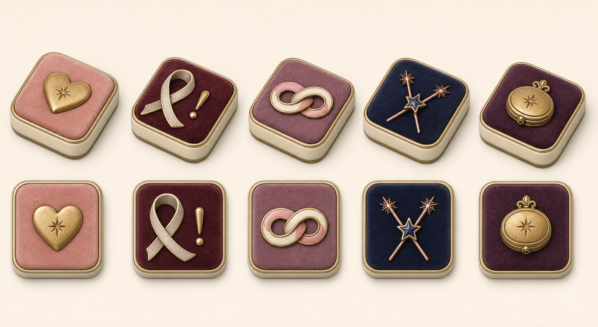
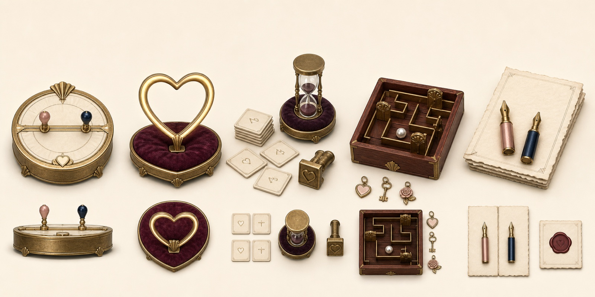
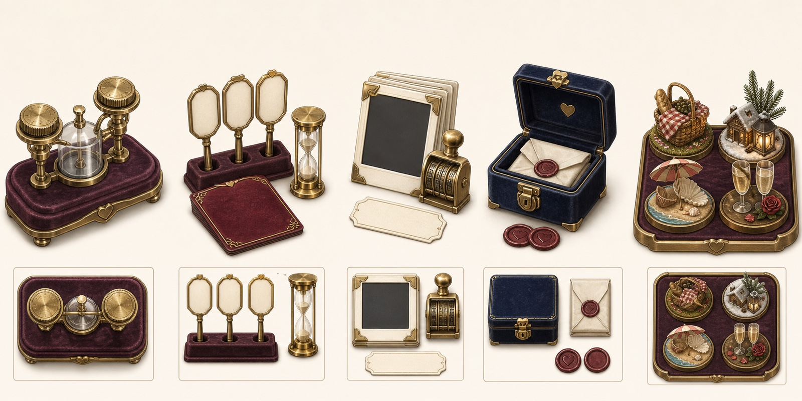

# At Long Last — 3D Art Concept Handoff

The board should favor primitives for anything whose identity comes from material,
proportion, and a simple icon. Reserve custom GLBs for props whose silhouette or
animation carries the idea.

## Tile types

The board has five functional tile types:

| Type | Current named spaces | Visual direction | Build route |
| --- | --- | --- | --- |
| Heart | Starlight Start, Glow Up, Glad You Came, Heart Burst, Crowd Roar | Blush velvet inset, raised brass heart, tiny starburst | Rounded boxes, thin inset, embossed icon |
| Oops | Soft Reset, Rain Check, Trip Up, Spilled Soda | Wine velvet inset, loose ribbon loop, small brass exclamation | Rounded boxes, curved ribbon or textured icon plane |
| Connection | Spark Check-In, Story Chain, Gratitude Drop, Story Swerve | Mauve velvet inset, two intertwined ribbons or rings | Rounded boxes, two simple curves/rings |
| Duel | Duel Beat, Duel Spark, Bonus Beat, Final Glow | Midnight velvet inset, crossed rose-gold sparklers, enamel star | Rounded boxes, cylinders, small star |
| Keepsake | Keepsake Kiosk, Souvenir Stop, Prize Corner | Plum velvet inset, raised locket or trinket-box emblem | Rounded boxes, cylinders, shallow relief |

All five can share one primitive tile body. The inset material, icon assembly,
and label texture provide the variation.

Concept order, left to right: Heart, Oops, Connection, Duel, Keepsake. The top
row is the three-quarter modeling view; the lower row is the top view.

## Primitive-first kit

These do not need custom models:

- Rounded tile body, velvet inset, brass piping, and flat label/icon layer.
- Velvet die with sphere pips.
- Continuum dial body, track, and two marker pins.
- Heart-ring rhythm target and its velvet base.
- Ivory letter tiles, timer body, and printing block.
- Maze tray, walls, gates, pearl token, and simple destination charms.
- Drawing paper, prompt cards, caption labels, photo frames, and corner mounts.
- Tuning dials, resonance plinth, glass chamber, and connecting rods.
- Bid paddles, challenge card, and sand timer.
- Date-stamp wheels, vault box body, latch, notes, and wax seals.

Use generated texture maps for velvet, paper, ivory, enamel, tarnished brass,
rosewood, and wax. Geometry should remain simple and reusable.

## Mini-game wishlist A

Concept clusters, left to right:

1. Vibe Check — brass-and-enamel continuum dial with two marker pins.
2. Tempo Tap — softly glowing heart-ring target on a velvet base.
3. Word Weaver — ivory letter tiles, velvet timer, and printing block.
4. Dual-Axis Maze — shallow maze, pearl token, brass gates, and destination charms.
5. Blind Canvas — deckled paper halves, paired nibs, and wax-seal prompt card.

## Mini-game wishlist B

Concept clusters, left to right:

1. Harmonic Lock — twin brass dials and a glass resonance chamber.
2. Bluff Bidding — bid paddles, velvet challenge cards, and sand timer.
3. Photo Flashback — instant-photo frames, date stamp, mounts, and caption label.
4. The Vault — velvet vault box, paper notes, latch, and reusable seals.
5. Seasonal packs — picnic night, snowy cabin, beach dusk, and anniversary table.

## Best custom-GLB candidates

- Player pieces and characterful tokens.
- Seasonal basket, snowy cabin, lantern, parasol, champagne flutes, and rose.
- Detailed destination charms if their silhouettes must read at board scale.
- Animated vault hinges or a mechanical resonance chamber if the primitive
  version does not provide enough personality.

The simple versions of all four can still be prototyped from primitives first,
then replaced one-for-one with GLBs without changing game logic.
